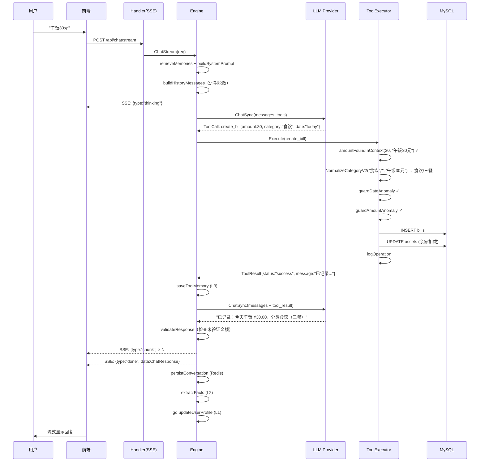
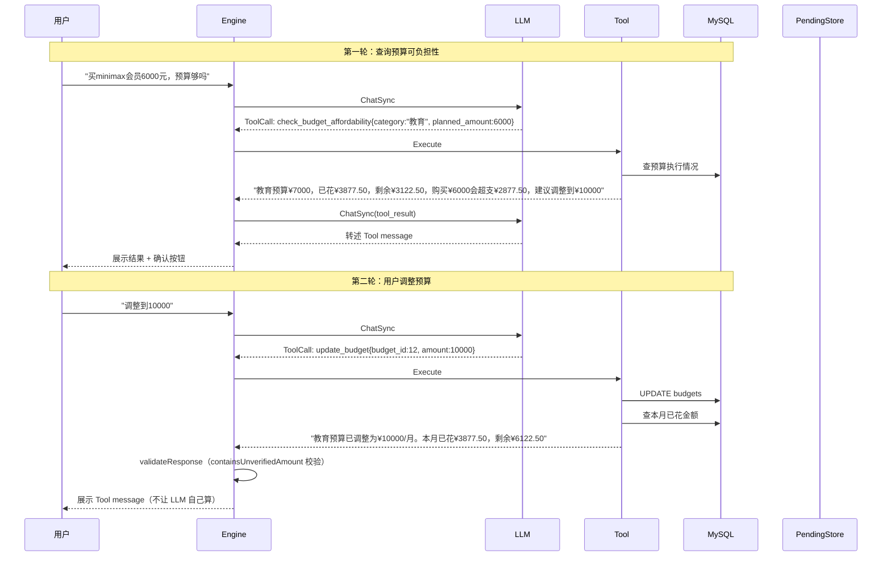
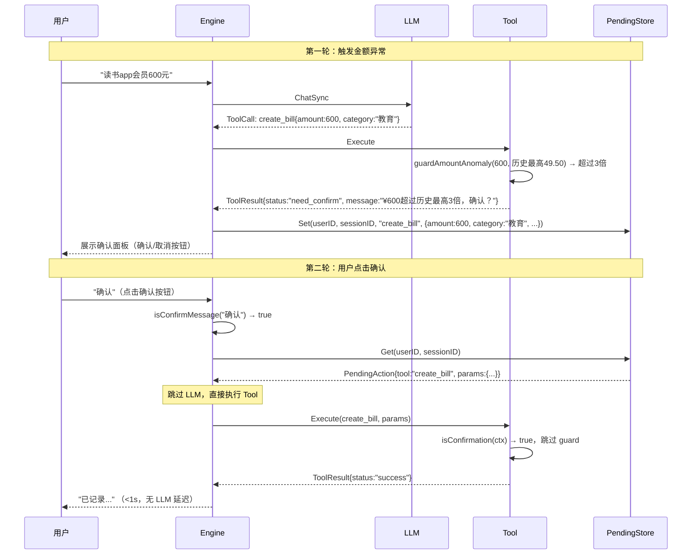
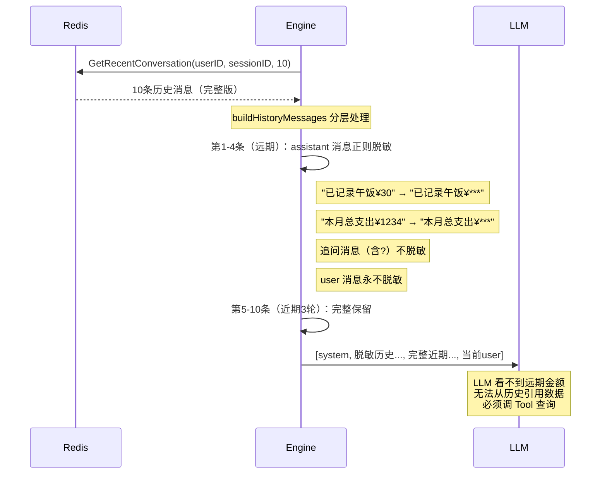
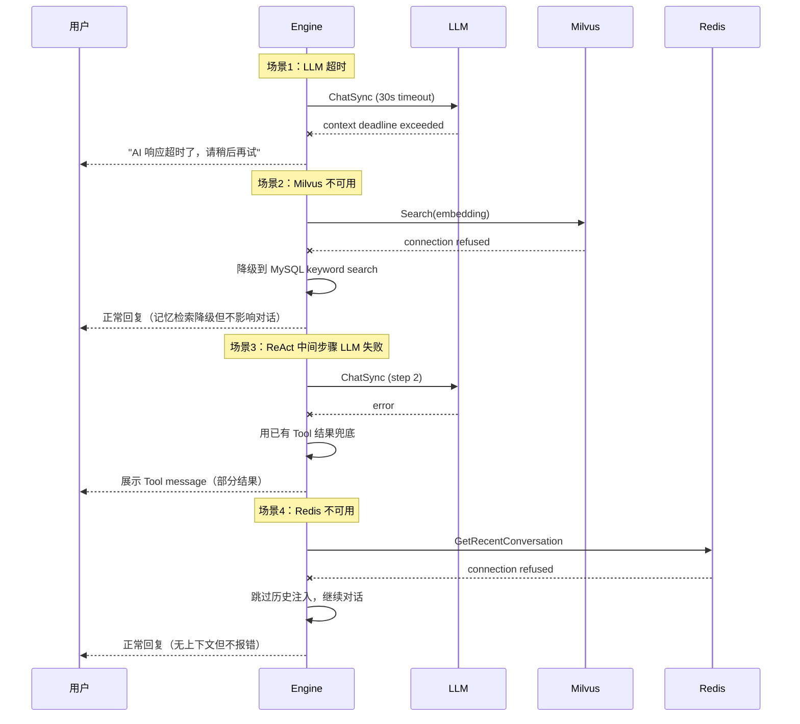
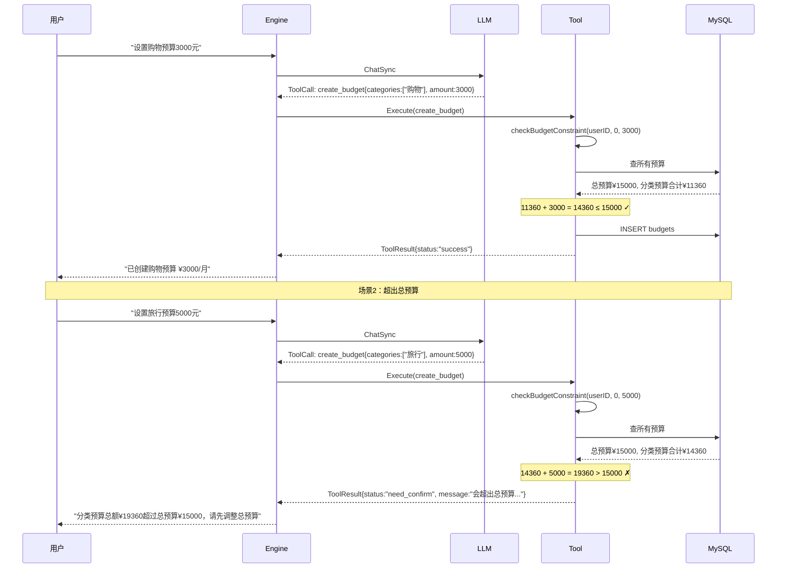
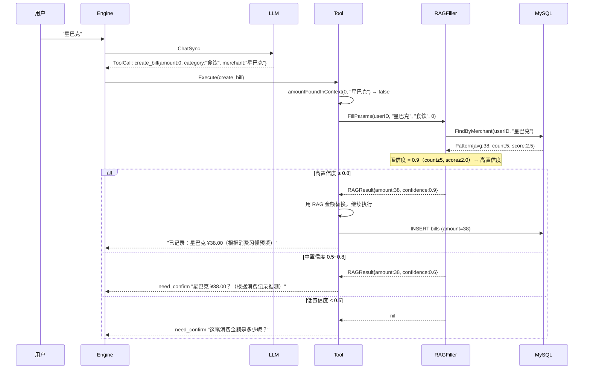

# 咔皮记账 AI 助手 — 关键时序图

## 一、记账流程（单步直达）

用户说"午饭30元"，Engine 识别意图后调用 create_bill Tool。

## 二、预算可负担性查询 + 调整（多步 ReAct）

用户问"买6000的会员预算够吗"→ 不够 → "调整到10000" → 确认。

## 三、need_confirm + PendingAction 确认流程

用户记大额消费触发金额异常检测，确认后通过 PendingAction 快速执行。

## 四、对话历史脱敏注入

展示 Engine 如何构建注入 LLM 的消息列表。

## 五、故障降级流程

## 六、总预算约束校验流程

用户创建分类预算时，Engine 校验分类预算之和不超过总预算。

## 七、RAG 消费模式预填流程

用户说"星巴克"，Engine 从 L5 消费模式中检索历史消费习惯，按置信度决定交互方式。

