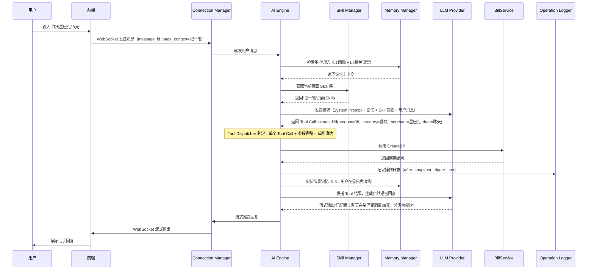
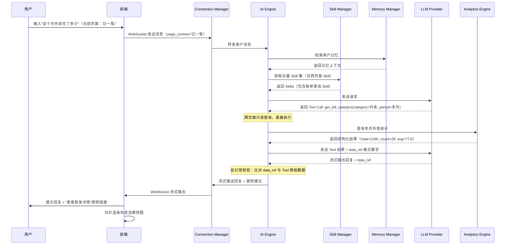
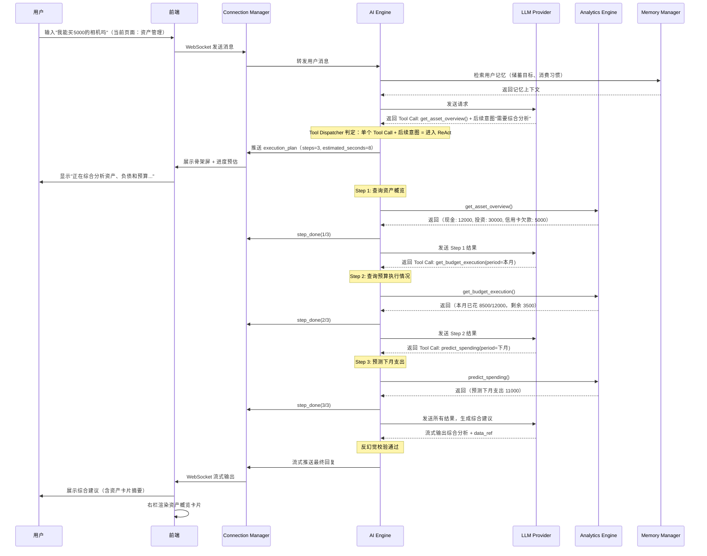
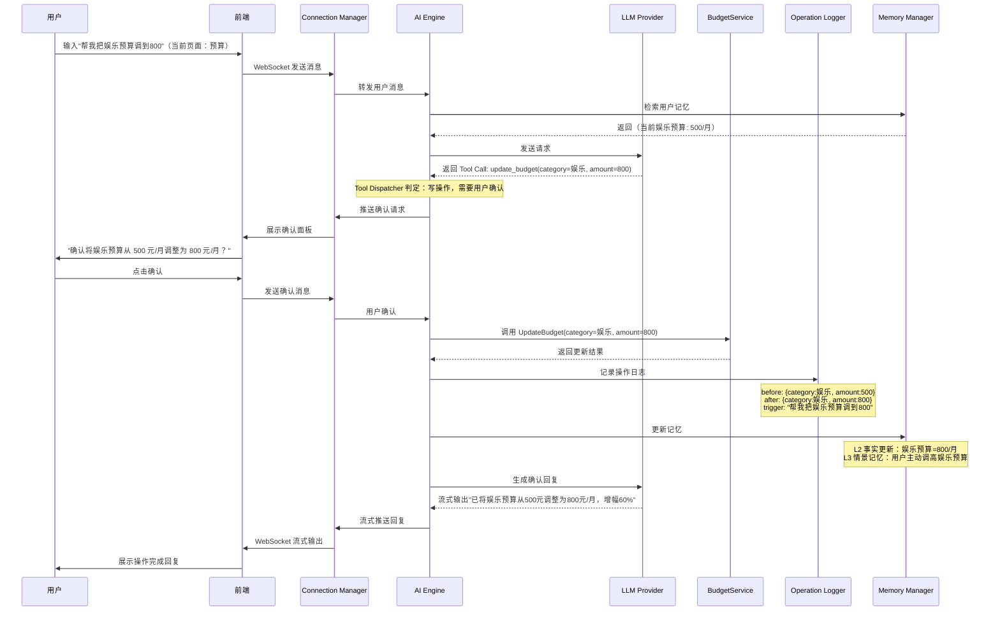

# 咔皮记账 AI 助手 — 设计规格

> 版本：1.0 | 日期：2026-04-29
> 本文档整合所有已确认的设计决策，作为实施阶段的唯一权威参考。

---

## 1. 项目概述

### 1.1 业务背景

咔皮记账 App 需要在每个核心页面（首页、记一笔、账单详情、预算、报表、资产管理）内嵌一个全场景 AI 助手。用户可随时唤起助手，通过自然语言完成记账、查询、分析、预算调整等操作。

典型交互场景：

- 记一笔页面：用户说"昨天星巴克 38 元"，助手完成结构化录入
- 账单详情页面：用户问"这个月外卖花了多少？比上月多吗？"，助手基于账本数据回答
- 预算页面：用户说"帮我把娱乐预算调到 800"，助手完成修改并解释变化
- 资产页面：用户问"我能不能买这个 5000 元的相机？"，助手综合负债、预算、现金流给出建议

### 1.2 目标

- 支持 30~100 路并发会话（长连接 + 流式输出）
- 首字延迟 P95 <= 5s，端到端 Tool 调用 P95 <= 12s
- 每用户独立持久化 Memory（画像、偏好、历史事实）
- 基于 Skill 的能力扩展机制，业务侧可独立迭代，无需重启服务
- page-aware 设计，根据来源页面动态裁剪可用 Skill 与工具集
- 多租户隔离：Memory、Session、Skill 权限严格隔离

### 1.3 非目标

- 不实现完整咔皮记账业务后端，账单/预算/资产接口通过 Mock 实现
- 不进行模型自训练或微调
- 不搭建生产级监控告警体系，仅输出监控设计思路与核心指标
- 不开发 App 端完整 UI，以 Web Demo 满足演示需求

### 1.4 交付要求

1. 可运行原型（prototype），打通全部 6 个页面场景端到端 Demo
2. 完整可复盘架构设计文档，包含组件图、关键时序图、容量估算

### 1.5 核心设计原则

| 原则 | 含义 |
|------|------|
| 一轮完成 | 能一次 Tool Call 解决的不进 ReAct，减少 LLM 调用次数 |
| 零幻觉 | 五层反幻觉防线，LLM 不做数值计算，只做推理和表达 |
| 模型无关 | LLM 层抽象为 interface，支持多模型切换 |
| 多租户隔离 | 所有数据查询自动带 `WHERE user_id = ?`，用户间数据不可交叉 |

---

## 2. 系统架构

### 2.1 架构风格

单体 + 插件化（可拆分的单体）：单 Go 服务，内部通过 Go interface 严格解耦各子系统。定义清晰的内部 API 边界，当前单进程运行，未来可沿 interface 边界拆为微服务。

### 2.2 双通道设计

```
客户端
  ├── WebSocket 长连接（主通道）
  │     ├── 对话流式输出
  │     ├── 服务端主动推送（提醒、预警）
  │     └── 心跳检测 + 消息去重
  └── HTTP REST API（降级通道 + 业务 CRUD）
        ├── 对话请求：HTTP POST + SSE 流式响应
        ├── 主动推送：客户端轮询（30s 间隔）
        └── 业务 CRUD：标准 REST 接口
```

### 2.3 部署形态

Docker Compose 编排四个服务：

```
┌─────────────────────────────────────────────┐
│              Docker Compose                  │
│                                              │
│  ┌──────────┐  ┌───────┐  ┌───────┐        │
│  │ go-server │  │ MySQL │  │ Redis │        │
│  │  :8080    │  │ :3306 │  │ :6379 │        │
│  └────┬─────┘  └───┬───┘  └───┬───┘        │
│       │            │          │              │
│       └────────────┴──────────┘              │
│                    │                         │
│              ┌─────┴─────┐                   │
│              │  Milvus   │                   │
│              │  :19530   │                   │
│              └───────────┘                   │
└─────────────────────────────────────────────┘
```

### 2.4 核心子系统及 interface 边界

| 子系统 | 职责 | 关键 interface |
|--------|------|----------------|
| Auth Middleware | JWT 校验、user_id 注入、多租户隔离 | Authenticator |
| Connection Manager | WebSocket/HTTP 双通道、降级恢复 | Connector |
| AI Engine | 会话管理、LLM 抽象层、Tool 调度、流式输出 | LLMProvider, ToolExecutor |
| Skill Manager | 文件加载 + DB 覆盖、页面感知、热更新 | SkillRegistry, SkillLoader |
| Memory Manager | 四层记忆、多租户隔离、向量检索 | MemoryStore, MemoryRetriever |
| Analytics Engine | 统计分析 Skill、预计算调度、预测 | Analyzer, Predictor |
| Operation Logger | 写操作日志、快照、恢复 | OpLogger, OpRestorer |
| Biz Service (Mock) | 账单/预算/资产/报表业务层 | BillService, BudgetService, AssetService |

---

## 3. 核心子系统设计

### 3.1 Auth Middleware

#### JWT Token 校验

用户登录后获取 JWT Token，payload 携带 `user_id`。Auth 中间件统一拦截所有请求：

- HTTP 请求：从 `Authorization: Bearer <token>` 头部提取并校验
- WebSocket 握手：从握手请求的 query 参数或首条消息中提取并校验

#### user_id 注入 Context

校验通过后将 `user_id` 注入 Go `context.Context`，各子系统通过 context 获取 user_id。

#### 多租户数据隔离机制

- 核心机制：数据归属隔离，不是角色权限
- 所有数据查询自动带 `WHERE user_id = ?`
- 无需 RBAC/ABAC，未来如需角色体系可在 JWT payload 扩展 `role` 字段

#### 统一拦截

```go
// Authenticator 接口定义
type Authenticator interface {
    // ValidateToken 校验 JWT Token，返回 user_id
    ValidateToken(token string) (uint64, error)
    // HTTPMiddleware 返回 HTTP 中间件
    HTTPMiddleware() gin.HandlerFunc
    // WSAuthHandler 校验 WebSocket 握手
    WSAuthHandler(conn *websocket.Conn) (uint64, error)
}
```

### 3.2 Connection Manager

#### WebSocket 长连接管理

- 全局持久连接，挂在 App 层，不随 Vue Router 切换断开
- 支持 30~100 路并发长连接
- 连接注册/注销由 Connection Manager 统一管理

#### 心跳检测机制

- 服务端每 15s 发送 ping，客户端回复 pong
- 30s 无 pong 判定连接断开，触发清理和重连逻辑

#### 消息去重

- 每条消息携带唯一 `message_id`（客户端生成 UUID）
- 服务端维护最近 5 分钟的 message_id 集合（Redis SET + TTL）
- 重复 message_id 直接丢弃，返回已有结果

#### HTTP 降级策略

**触发降级条件：**

- WebSocket 连接连续 3 次握手失败
- 已建立连接心跳超时（30s 无 pong）后重连 2 次失败
- 网络切换事件（WiFi -> 蜂窝）导致连接中断

**降级行为：**

- 对话请求切换为 HTTP POST，流式输出走 SSE（Server-Sent Events）
- 主动推送改为客户端轮询（间隔 30s，可配置）
- 客户端本地标记当前为降级模式

**恢复策略：**

- 降级后启动后台探测：指数退避尝试 WebSocket 握手（10s -> 20s -> 40s -> 最大 120s）
- 握手成功后不立即切换，先完成一次完整心跳周期确认连接稳定
- 确认稳定后，等当前进行中的 HTTP 请求完成，再切回 WebSocket
- 切换期间通过 message_id 去重 + 服务端消息队列暂存保证消息不丢失

**防抖动机制：**

- 5 分钟内发生 2 次以上 WebSocket <-> HTTP 切换，锁定 HTTP 模式 10 分钟
- 避免网络不稳定时频繁切换带来的体验劣化

```go
// Connector 接口定义
type Connector interface {
    // HandleWebSocket 处理 WebSocket 连接
    HandleWebSocket(w http.ResponseWriter, r *http.Request)
    // HandleHTTP 处理 HTTP 降级请求
    HandleHTTP(w http.ResponseWriter, r *http.Request)
    // SendToUser 向指定用户推送消息
    SendToUser(userID uint64, msg *Message) error
    // BroadcastToUser 向用户所有连接广播
    BroadcastToUser(userID uint64, msg *Message) error
    // GetConnectionStatus 获取用户连接状态
    GetConnectionStatus(userID uint64) ConnectionStatus
}
```

### 3.3 AI Engine

#### Session Manager

- 用户级 Session，不是页面级（页面只是上下文参数）
- Session 记录 `last_active_at`，7 天无活动自动过期
- 对话历史窗口：Redis 保留最近 50 轮（滑动窗口），超出归档到 MySQL
- LLM 上下文注入：最近 10~20 轮完整对话 + 更早对话的摘要
- 摘要生成时机：每 20 轮对话触发一次，摘要存入 Redis 替代原始对话
- 未完成任务处理：只读任务继续执行结果缓存；写操作暂存确认请求，5 分钟未确认自动取消

#### LLM Abstraction Layer

```go
// LLMProvider 模型无关抽象
type LLMProvider interface {
    // Chat 对话接口，支持流式输出和 Tool 调用
    Chat(ctx context.Context, messages []Message, tools []Tool) (StreamReader, error)
    // Embedding 向量化接口，支持批量处理
    Embedding(ctx context.Context, texts []string) ([][]float32, error)
}
```

- 初期选一个主力模型跑通 prototype，保留扩展性
- 统一封装：Prompt 模板、Tool 调用协议、流式输出接口
- Embedding 维度统一为固定值（如 1536），切换模型时需重建 Milvus 索引
- 批量 Embedding 支持：预计算场景下批量处理，减少 API 调用次数

#### Intent Router

- 全量 Skill 摘要注入 System Prompt（每 Skill 3~5 行，总量 <= 2000 tokens）
- LLM 原生意图识别：不引入额外分类器，由 LLM 根据 Skill 摘要自行选择 Tool
- 跨页面意图处理：优先在当前页面上下文内回答，同时提供相关页面跳转入口
- 只读场景综合数据直接回答；写操作场景先给建议，用户确认后执行

#### Tool Dispatcher

- 置信度判定基于 LLM 输出结构（非额外打分）
- 业务规则兜底：参数缺失时要求澄清，不猜测
- 写操作确认流程：展示操作预览 -> 用户确认 -> 执行 -> 记录日志 -> 更新记忆

#### ReAct Controller

**路径判定标准（5 种输出 -> 5 种路径）：**

| LLM 第一轮输出 | 判定 | 路径 |
|----------------|------|------|
| 单个 Tool Call + 参数完整 | 单步直达 | 执行 -> 结果给 LLM -> 生成回复 -> 返回 |
| 多个 Tool Call（并行无依赖） | 单步并行 | 并行执行 -> 结果合并给 LLM -> 生成回复 |
| 多个 Tool Call（有依赖链） | 进入 ReAct | 按依赖顺序逐步执行 |
| 单个 Tool Call + 后续意图表达 | 进入 ReAct | 执行 -> 观察 -> 继续循环 |
| 无 Tool Call（纯文本/澄清） | 直接返回 | 不进入执行流程 |

**约束：**

- 最大步数限制：单次对话最多 5 轮循环
- 写操作打断：ReAct 链中遇到写操作时暂停，展示确认，确认后继续
- Go 原生实现循环控制器，不引入外部 Agent 框架

#### 反幻觉机制

**五层防线：**

1. **Skill 约束层**：LLM 只能调用已注册的 Tool，不能自由发挥
2. **数值隔离层**：LLM 不做数值计算，只做推理和表达，数值由 Tool 返回
3. **结构化引用层**：LLM 输出必须包含 `data_ref` 结构化数据引用
4. **JSON 校验层**：Tool Dispatcher 对 `data_ref` 做 JSON 级数值比对
5. **派生值校验层**：校验计算公式正确性（如增长率 = (当期-上期)/上期）

**data_ref 结构化引用格式：**

```json
{
  "display": "本月外卖共消费 2,180 元，比上月（1,850 元）多了 330 元，环比增长 17.8%。",
  "data_ref": {
    "current_month_total": 2180,
    "last_month_total": 1850,
    "diff": 330,
    "growth_rate": 0.178
  },
  "tool_results_used": ["bill_statistics_result_001"]
}
```

**校验流程：**

1. Tool 执行后，结果以唯一 ID 存入当前会话临时存储
2. LLM 生成回复时，`data_ref` 中引用的数值必须与 Tool 返回的原始数据一致
3. Tool Dispatcher 做 JSON 级别数值比对（精确匹配 + 允许四舍五入误差 <= 0.5%）
4. 派生值校验计算公式正确性

**校验结果处理：**

- 全部一致：放行
- 原始数值不一致：用 Tool 原始数据替换 `display` 中的错误数值
- 派生值计算错误：用正确计算结果替换
- 校验耗时：纯 JSON 比对 + 简单算术校验，<= 100ms

#### 执行反馈

进入 ReAct 或多步执行时，Tool Dispatcher 返回执行计划摘要：

```json
{
  "type": "execution_plan",
  "steps": 3,
  "estimated_seconds": 8,
  "description": "需要查询资产、负债和预算数据后综合分析"
}
```

前端处理：

- 收到 `execution_plan` 后展示带进度预估的骨架屏
- 进度条按预估时间匀速推进（不依赖服务端推送）
- 每步 Tool 完成后可选推送 `{"type": "step_done", "step": 1, "total": 3}`
- 所有步骤完成后，最终回复走正常流式输出

### 3.4 Skill Manager

#### 混合加载机制

- **文件层（基础集）**：内置 Skill 以 YAML 定义，随代码部署
  - 文件监听：通过 `fsnotify` 监听 Skill 文件变更，热加载
- **DB 层（覆盖层）**：业务自定义 Skill 通过 MySQL 管理
  - 运行时变更通过轮询（10s 间隔）或事件通知热更新

#### 加载顺序

1. 启动时加载文件层所有 Skill（基础集）
2. 从 DB 加载所有 Skill，同名覆盖文件层版本
3. 运行时 DB 层变更通过轮询热更新
4. 文件层变更通过 fsnotify 监听热更新

#### 冲突解决

- 优先级：DB 层 > 文件层（同名时 DB 覆盖）
- `enabled` 状态：覆盖文件层同名 Skill
- `disabled` 状态：自动回退到文件层版本（如果存在），否则该 Skill 不可用
- 支持一键禁用，用于 DB 层 Skill 出 bug 时快速回退

#### 版本追溯

- DB 层 Skill 记录 `overrides_file_version` 字段，标记被覆盖的文件层版本
- 文件层 Skill 在文件头部声明版本号（如 `version: 1.2.0`）
- 回退时可对比 DB 版本与文件层版本的差异

#### 页面感知

- `page_context` -> Skill 集映射：每个 Skill 声明所属页面
- 请求到达时根据当前 `page_context` 筛选可用 Skill 集
- 跨页面 Skill：声明 `page: ["*"]` 表示全局可用

#### Skill 定义格式

```yaml
name: record_bill
page: ["记一笔", "首页"]
type: write
version: "1.0.0"
trigger: "用户表达记账意图时触发"
params:
  - name: amount
    type: float
    required: true
    desc: "金额"
  - name: category
    type: string
    required: true
    desc: "分类"
  - name: merchant
    type: string
    required: false
    desc: "商户名称"
  - name: date
    type: date
    required: false
    desc: "日期，默认今天"
  - name: note
    type: string
    required: false
    desc: "备注"
prompt_template: |
  根据用户输入提取记账信息，调用 create_bill 工具完成记录。
```

#### 灰度发布预留

- DB 层 Skill 支持 `gray_ratio` 字段（0~100）
- 按 user_id 哈希决定是否命中新版本
- prototype 阶段不实现，但数据模型预留字段

```go
// SkillRegistry 接口定义
type SkillRegistry interface {
    // GetSkillsByPage 获取指定页面的可用 Skill 集
    GetSkillsByPage(page string) []Skill
    // GetAllSkills 获取全量 Skill（用于摘要注入）
    GetAllSkills() []Skill
    // ReloadFromFile 从文件重新加载
    ReloadFromFile(path string) error
    // ReloadFromDB 从数据库重新加载
    ReloadFromDB() error
}
```

### 3.5 Memory Manager

#### 四层架构

| 层级 | 名称 | 内容 | 存储特征 | 示例 |
|------|------|------|----------|------|
| L1 | 用户画像 | 偏好、习惯、财务特征标签 | 长期，低频更新 | "偏好简洁回复"、"月光族" |
| L2 | 事实记忆 | 具体财务事实 | 长期，结构化，可被推理引用 | "月租3500"、"两张信用卡" |
| L3 | 情景记忆 | 过去的决策上下文和交互场景 | 中长期，关联操作日志 | "上月因超支调低了娱乐预算" |
| L4 | 对话历史 | 当前及近期对话上下文 | 短期，会话级 | 最近 50 轮对话 |

#### 向量化策略

| 记忆层 | MySQL（结构化存储） | Milvus（向量化） | Redis | 检索方式 |
|--------|---------------------|------------------|-------|----------|
| L1 用户画像 | 结构化标签字段 | 不需要 | — | 按 user_id 精确查询 |
| L2 事实记忆 | 结构化字段（金额、分类、实体） | 文本描述做向量化 | — | 精确查询 + 语义检索双通道 |
| L3 情景记忆 | 元数据（时间、关联 op_log_id） | 场景描述做向量化 | — | 主要走语义检索 |
| L4 对话历史 | 归档（超出窗口的历史） | 不需要 | 最近 50 轮 | 按时间顺序取最近轮次 |

#### 多租户隔离

- 所有记忆查询必须带 `user_id` 条件
- Milvus 向量检索时通过 partition 或 filter 实现用户隔离
- 禁止跨用户记忆访问

#### Embedding 生成策略

- L2 事实记忆：写入/更新时**同步**生成 Embedding 并写入 Milvus
- L3 情景记忆：写入时**异步**生成 Embedding（写入频率较高，异步避免阻塞）

#### L2 双通道检索示例

- 精确查询："用户月租多少" -> MySQL `WHERE user_id=? AND fact_type='rent'`
- 语义检索："用户的固定支出有哪些" -> Milvus 向量相似度匹配

#### 检索策略

每次对话前自动检索相关记忆注入 LLM 上下文：

1. L1 画像：按 user_id 全量加载（数据量小）
2. L2 事实：根据用户输入做语义检索，取 Top-K 相关事实
3. L3 情景：根据用户输入做语义检索，取最近相关情景
4. L4 对话：从 Redis 取最近 10~20 轮完整对话

```go
// MemoryStore 接口定义
type MemoryStore interface {
    // SaveMemory 保存记忆
    SaveMemory(ctx context.Context, memory *Memory) error
    // UpdateMemory 更新记忆
    UpdateMemory(ctx context.Context, memory *Memory) error
    // DeleteMemory 软删除记忆
    DeleteMemory(ctx context.Context, id uint64) error
}

// MemoryRetriever 接口定义
type MemoryRetriever interface {
    // GetUserProfile 获取用户画像（L1）
    GetUserProfile(ctx context.Context, userID uint64) (*UserProfile, error)
    // SearchFacts 搜索事实记忆（L2），支持精确+语义双通道
    SearchFacts(ctx context.Context, userID uint64, query string, topK int) ([]Memory, error)
    // SearchEpisodes 搜索情景记忆（L3）
    SearchEpisodes(ctx context.Context, userID uint64, query string, topK int) ([]Memory, error)
    // GetRecentConversation 获取最近对话（L4）
    GetRecentConversation(ctx context.Context, userID uint64, limit int) ([]Message, error)
}
```

### 3.6 Analytics Engine

#### Skill 化分析

统计分析封装为内置 Skill，LLM 调用工具获取结构化结果后用自然语言表达。LLM 不做数值计算，只做推理和表达，保证结果准确可控。

#### 预计算调度

**双触发机制：定时 + 事件驱动**

定时预计算：
- 每天凌晨全量刷新所有用户的核心指标（月度汇总、分类占比、预算执行率）
- 按 `user_id % 60` 分散执行时间（分钟偏移），避免同时触发
- 预计算结果写入 Redis，设置 TTL = 25 小时（覆盖到下次刷新 + 1 小时容错）

事件驱动刷新：
- 写操作完成后，Op Logger 发布事件（如 `bill_created`、`budget_updated`）
- Analytics Engine 订阅事件，异步刷新受影响的缓存 key
- 刷新粒度：只刷新受影响的指标，不全量重算
  - 新增账单 -> 刷新该分类的月度汇总、总支出、预算执行率
  - 修改预算 -> 刷新该分类的预算执行率
- 事件处理设置 100ms 去抖（debounce），批量写操作合并为一次刷新

#### 缓存策略

- Redis TTL = 25h
- 缓存未命中时走实时计算，计算结果回填缓存
- 实时计算设置超时 3s，超时返回"数据计算中，请稍后"而非阻塞

#### 分析能力矩阵

| 能力域 | 具体能力 | 实现方式 |
|--------|----------|----------|
| 账单分析 | 同比分析、环比分析、趋势分析、异常检测 | 预计算 + 缓存 |
| 预算分析 | 执行率、合理性评估、超支预警 | 预计算 + 事件刷新 |
| 资产分析 | 净资产变化、现金流分析、负债比率 | 预计算 + 缓存 |
| 预测能力 | 消费预测、行为预测、查询偏好预测、预算规划 | 统计规律 + 记忆上下文 |
| 提醒能力 | 周期性账单提醒、预算超支预警、异常消费提醒、目标进度提醒 | 定时检测 + 记忆判断 |

#### 记忆协同

- 行为预测 = 统计规律 + 记忆上下文：统计得出规律，记忆提供个性化修正
- 主动推送 = 时间触发 + 记忆判断：定时检测 + 记忆中的用户偏好决定是否推送
- 预算建议 = 历史统计 + 用户目标记忆：不简单取均值，结合用户储蓄目标等记忆做智能建议

```go
// Analyzer 接口定义
type Analyzer interface {
    // GetBillStatistics 获取账单统计
    GetBillStatistics(ctx context.Context, userID uint64, params *StatParams) (*BillStats, error)
    // GetBudgetExecution 获取预算执行率
    GetBudgetExecution(ctx context.Context, userID uint64, period string) (*BudgetExecution, error)
    // GetAssetOverview 获取资产概览
    GetAssetOverview(ctx context.Context, userID uint64) (*AssetOverview, error)
}

// Predictor 接口定义
type Predictor interface {
    // PredictSpending 预测未来支出
    PredictSpending(ctx context.Context, userID uint64, category string, period string) (*Prediction, error)
    // PredictBehavior 预测用户行为
    PredictBehavior(ctx context.Context, userID uint64) (*BehaviorPrediction, error)
}
```

### 3.7 Operation Logger

#### 写操作日志

每次写操作记录完整审计信息：

- `who`：user_id
- `what`：operation_type（create/update/delete）+ target_table + target_id
- `when`：created_at
- `before_snapshot`：操作前数据快照（JSON）
- `after_snapshot`：操作后数据快照（JSON）
- `session_id`：关联会话
- `trigger`：用户原话（触发该操作的自然语言输入）

#### 软删除策略

- 所有删除为软删除（`is_deleted = true`），不物理清除
- 30 天后可清理（定时任务扫描 `is_deleted = true AND updated_at < 30天前`）
- 清理前检查是否有关联的情景记忆引用

#### 恢复机制

恢复流程：

1. 用户用自然语言描述要恢复的内容（如"把刚才删掉的那笔星巴克加回来"）
2. 记忆检索定位相关情景记忆
3. 通过情景记忆关联的 `operation_log_id` 找到精确操作日志
4. 从 `before_snapshot` 提取恢复数据
5. 执行恢复（本质上是一次新的写入操作）

#### 与记忆系统关联

- 情景记忆（L3）自动关联关键写操作的 `operation_log_id`
- 通过 `related_op_log_ids` 字段建立双向索引
- 恢复时可通过记忆快速定位到具体操作日志

```go
// OpLogger 接口定义
type OpLogger interface {
    // LogOperation 记录写操作日志
    LogOperation(ctx context.Context, log *OperationLog) error
    // GetOperationsByUser 获取用户操作历史
    GetOperationsByUser(ctx context.Context, userID uint64, limit int) ([]OperationLog, error)
    // GetOperationByID 获取单条操作日志
    GetOperationByID(ctx context.Context, id uint64) (*OperationLog, error)
}

// OpRestorer 接口定义
type OpRestorer interface {
    // RestoreFromLog 从操作日志恢复数据
    RestoreFromLog(ctx context.Context, logID uint64) error
    // FindRelatedLogs 通过记忆检索关联的操作日志
    FindRelatedLogs(ctx context.Context, userID uint64, query string) ([]OperationLog, error)
}
```

### 3.8 Biz Service（Mock）

#### 服务列表

| 服务 | 职责 | 核心方法 |
|------|------|----------|
| BillService | 账单 CRUD、分类管理 | Create, Update, Delete, Query, GetByCategory |
| BudgetService | 预算设置/调整、执行率计算 | Create, Update, GetByPeriod, GetExecution |
| AssetService | 资产管理、余额更新 | Create, Update, GetOverview, GetCashFlow |
| ReportService | 报表生成、趋势数据 | GetMonthlyReport, GetTrend, GetCategoryRatio |

#### Mock 数据层

- 提供真实结构的测试数据，覆盖各种边界场景
- Mock 数据包含：多分类账单（3~6 个月历史）、多类型预算、多类型资产
- 数据量级：每用户约 200~500 条账单、5~10 个预算、3~5 个资产账户

#### AI 写操作复用 Biz Service

- AI 助手的写操作（记账、调预算等）必须通过 Biz Service 执行
- 不允许 AI Engine 直接操作数据库，保证业务规则一致性
- Biz Service 执行完成后通知 Op Logger 记录日志

```go
// BillService 接口定义
type BillService interface {
    CreateBill(ctx context.Context, bill *Bill) error
    UpdateBill(ctx context.Context, bill *Bill) error
    DeleteBill(ctx context.Context, id uint64) error
    QueryBills(ctx context.Context, userID uint64, filter *BillFilter) ([]Bill, error)
    GetBillStatsByCategory(ctx context.Context, userID uint64, period string) ([]CategoryStats, error)
}

// BudgetService 接口定义
type BudgetService interface {
    CreateBudget(ctx context.Context, budget *Budget) error
    UpdateBudget(ctx context.Context, budget *Budget) error
    GetBudgetsByPeriod(ctx context.Context, userID uint64, period string) ([]Budget, error)
    GetBudgetExecution(ctx context.Context, userID uint64, category string) (*Execution, error)
}

// AssetService 接口定义
type AssetService interface {
    CreateAsset(ctx context.Context, asset *Asset) error
    UpdateAsset(ctx context.Context, asset *Asset) error
    GetAssetOverview(ctx context.Context, userID uint64) (*AssetOverview, error)
    GetCashFlow(ctx context.Context, userID uint64, months int) (*CashFlow, error)
}
```

---

## 4. 前端设计

### 4.1 单页三栏布局

```
┌──────────────────────────────────────────────────────────────┐
│                        Header                                 │
├────────────┬─────────────────────────┬───────────────────────┤
│            │                         │                       │
│  左栏       │       中栏              │       右栏            │
│  页面切换器  │       对话窗口          │       动态内容面板     │
│            │                         │                       │
│  - 首页     │  [用户消息]             │  [图表/表格/卡片]     │
│  - 记一笔   │  [助手回复（流式）]      │                       │
│  - 账单详情  │  [确认面板]             │  [操作确认面板]        │
│  - 预算     │                         │                       │
│  - 报表     │                         │                       │
│  - 资产管理  │                         │                       │
│            │                         │                       │
│  ─────────  │                         │                       │
│  Skills列表 │                         │                       │
│  (当前页面)  │                         │                       │
│            │                         │                       │
├────────────┴─────────────────────────┴───────────────────────┤
│                     Status Bar                                │
└──────────────────────────────────────────────────────────────┘
```

### 4.2 六个核心页面

| 页面 | 核心能力 | 典型交互 |
|------|----------|----------|
| 首页 | 综合概览、主动推送、快速入口 | "今天花了多少"、主动推送月度摘要 |
| 记一笔 | 自然语言记账、批量录入 | "昨天星巴克38元"、"帮我记三笔" |
| 账单详情 | 查询分析、筛选、异常检测 | "这个月外卖花了多少比上月多吗" |
| 预算 | 预算设置/调整、执行率、合理性评估 | "帮我把娱乐预算调到800" |
| 报表 | 同比环比、趋势分析、分类占比 | "给我看最近三个月的消费趋势" |
| 资产管理 | 资产概览、现金流、综合建议 | "我能不能买这个5000元的相机" |

### 4.3 会话连续性

| 设计点 | 策略 |
|--------|------|
| WebSocket 连接 | 全局持久，挂在 App 层，不随 Vue Router 切换断开 |
| 对话窗口 | 全局组件，不随路由销毁 |
| 进行中的任务 | 继续执行，绑定发起时的 page_context 快照 |
| 新任务 | 使用切换后的新 page_context |
| 写操作确认 | 跨页面可确认，确认面板标注来源页面 |
| 对话历史 | 完整保留，每条消息标记页面来源 |
| HTTP 降级模式 | 同样适用，page_context 通过请求参数传递 |

### 4.4 页面切换行为

- 发送轻量消息 `{"type": "page_switch", "from": "记一笔", "to": "账单详情"}` 更新服务端 page_context
- 不断开 WebSocket，不清除对话历史
- 进行中的请求继续等待，结果正常展示在对话区
- 左栏 Skills 列表随页面切换实时更新

### 4.5 动态内容面板（右栏）

| 内容类型 | 触发场景 | 渲染组件 |
|----------|----------|----------|
| 饼图 | 分类占比查询 | ECharts Pie |
| 折线图 | 趋势分析 | ECharts Line |
| 柱状图 | 同比/环比对比 | ECharts Bar |
| 数据表格 | 账单列表、明细查询 | Table 组件 |
| 卡片摘要 | 资产概览、预算执行率 | Card 组件 |
| 操作确认面板 | 写操作确认 | Confirm Panel |

### 4.6 执行反馈

- 骨架屏：收到 `execution_plan` 后展示带进度预估的骨架屏
- 进度预估：进度条按预估时间匀速推进
- 可选步骤通知：每步完成后可选推送进度更新
- 最终回复：所有步骤完成后走正常流式输出

### 4.7 跨页面回答

- 对话区底部附跳转建议链接
- 链接点击后触发页面切换（左栏高亮变化 + page_switch 消息）
- 跨页面写操作确认面板标注来源页面

---

## 5. 数据模型

### 5.1 users 表

| 字段 | 类型 | 约束 | 说明 |
|------|------|------|------|
| id | BIGINT UNSIGNED | PK, AUTO_INCREMENT | 用户 ID |
| username | VARCHAR(64) | UNIQUE, NOT NULL | 用户名 |
| password_hash | VARCHAR(255) | NOT NULL | 密码哈希（bcrypt） |
| created_at | DATETIME | NOT NULL, DEFAULT NOW() | 创建时间 |
| updated_at | DATETIME | NOT NULL, DEFAULT NOW() ON UPDATE | 更新时间 |

### 5.2 sessions 表

| 字段 | 类型 | 约束 | 说明 |
|------|------|------|------|
| id | BIGINT UNSIGNED | PK, AUTO_INCREMENT | Session ID |
| user_id | BIGINT UNSIGNED | FK(users.id), INDEX | 用户 ID |
| last_active_at | DATETIME | NOT NULL | 最后活跃时间 |
| page_context | VARCHAR(32) | NOT NULL, DEFAULT '首页' | 当前页面上下文 |
| status | ENUM('active','expired') | NOT NULL, DEFAULT 'active' | 状态 |
| created_at | DATETIME | NOT NULL, DEFAULT NOW() | 创建时间 |

索引：`idx_user_status (user_id, status)`

### 5.3 bills 表（Mock）

| 字段 | 类型 | 约束 | 说明 |
|------|------|------|------|
| id | BIGINT UNSIGNED | PK, AUTO_INCREMENT | 账单 ID |
| user_id | BIGINT UNSIGNED | FK(users.id), INDEX | 用户 ID |
| amount | DECIMAL(12,2) | NOT NULL | 金额 |
| category | VARCHAR(32) | NOT NULL | 分类（餐饮/交通/娱乐等） |
| merchant | VARCHAR(128) | | 商户名称 |
| date | DATE | NOT NULL | 账单日期 |
| note | VARCHAR(255) | | 备注 |
| is_deleted | TINYINT(1) | NOT NULL, DEFAULT 0 | 软删除标记 |
| created_at | DATETIME | NOT NULL, DEFAULT NOW() | 创建时间 |
| updated_at | DATETIME | NOT NULL, DEFAULT NOW() ON UPDATE | 更新时间 |

索引：`idx_user_date (user_id, date)`、`idx_user_category (user_id, category)`

### 5.4 budgets 表（Mock）

| 字段 | 类型 | 约束 | 说明 |
|------|------|------|------|
| id | BIGINT UNSIGNED | PK, AUTO_INCREMENT | 预算 ID |
| user_id | BIGINT UNSIGNED | FK(users.id), INDEX | 用户 ID |
| category | VARCHAR(32) | NOT NULL | 分类 |
| amount | DECIMAL(12,2) | NOT NULL | 预算金额 |
| period | ENUM('monthly','weekly') | NOT NULL, DEFAULT 'monthly' | 周期 |
| created_at | DATETIME | NOT NULL, DEFAULT NOW() | 创建时间 |
| updated_at | DATETIME | NOT NULL, DEFAULT NOW() ON UPDATE | 更新时间 |

索引：`idx_user_category_period (user_id, category, period)`

### 5.5 assets 表（Mock）

| 字段 | 类型 | 约束 | 说明 |
|------|------|------|------|
| id | BIGINT UNSIGNED | PK, AUTO_INCREMENT | 资产 ID |
| user_id | BIGINT UNSIGNED | FK(users.id), INDEX | 用户 ID |
| name | VARCHAR(64) | NOT NULL | 资产名称 |
| type | ENUM('cash','credit','investment','debt') | NOT NULL | 资产类型 |
| balance | DECIMAL(14,2) | NOT NULL, DEFAULT 0 | 余额/额度 |
| created_at | DATETIME | NOT NULL, DEFAULT NOW() | 创建时间 |
| updated_at | DATETIME | NOT NULL, DEFAULT NOW() ON UPDATE | 更新时间 |

索引：`idx_user_type (user_id, type)`

### 5.6 operation_logs 表

| 字段 | 类型 | 约束 | 说明 |
|------|------|------|------|
| id | BIGINT UNSIGNED | PK, AUTO_INCREMENT | 日志 ID |
| user_id | BIGINT UNSIGNED | FK(users.id), INDEX | 用户 ID |
| session_id | BIGINT UNSIGNED | FK(sessions.id) | 关联会话 |
| operation_type | ENUM('create','update','delete') | NOT NULL | 操作类型 |
| target_table | VARCHAR(64) | NOT NULL | 目标表名 |
| target_id | BIGINT UNSIGNED | NOT NULL | 目标记录 ID |
| before_snapshot | JSON | | 操作前快照 |
| after_snapshot | JSON | | 操作后快照 |
| trigger_text | VARCHAR(512) | | 触发该操作的用户原话 |
| created_at | DATETIME | NOT NULL, DEFAULT NOW() | 创建时间 |

索引：`idx_user_created (user_id, created_at)`、`idx_target (target_table, target_id)`

### 5.7 memories 表

| 字段 | 类型 | 约束 | 说明 |
|------|------|------|------|
| id | BIGINT UNSIGNED | PK, AUTO_INCREMENT | 记忆 ID |
| user_id | BIGINT UNSIGNED | FK(users.id), INDEX | 用户 ID |
| layer | ENUM('L1','L2','L3') | NOT NULL | 记忆层级 |
| content | TEXT | NOT NULL | 记忆内容 |
| fact_type | VARCHAR(32) | | 事实类型（仅 L2，如 rent/salary/card） |
| metadata | JSON | | 元数据（时间范围、关联实体等） |
| related_op_log_ids | JSON | | 关联的操作日志 ID 列表 |
| source | ENUM('user_stated','system_inferred','tool_result') | NOT NULL | 来源 |
| embedding_id | VARCHAR(64) | | 关联 Milvus 向量 ID |
| is_verified | TINYINT(1) | NOT NULL, DEFAULT 0 | 是否经用户确认 |
| created_at | DATETIME | NOT NULL, DEFAULT NOW() | 创建时间 |
| updated_at | DATETIME | NOT NULL, DEFAULT NOW() ON UPDATE | 更新时间 |

索引：`idx_user_layer (user_id, layer)`、`idx_user_fact_type (user_id, fact_type)`

### 5.8 skills 表（DB 层）

| 字段 | 类型 | 约束 | 说明 |
|------|------|------|------|
| id | BIGINT UNSIGNED | PK, AUTO_INCREMENT | Skill ID |
| name | VARCHAR(64) | UNIQUE, NOT NULL | Skill 名称 |
| page | JSON | NOT NULL | 所属页面列表 |
| type | ENUM('read','write') | NOT NULL | 类型 |
| trigger_desc | VARCHAR(255) | NOT NULL | 触发条件描述 |
| params_schema | JSON | NOT NULL | 参数 Schema |
| prompt_template | TEXT | NOT NULL | Prompt 模板 |
| status | ENUM('enabled','disabled') | NOT NULL, DEFAULT 'enabled' | 状态 |
| overrides_file_version | VARCHAR(32) | | 被覆盖的文件层版本 |
| gray_ratio | TINYINT UNSIGNED | NOT NULL, DEFAULT 100 | 灰度比例（0~100） |
| version | VARCHAR(32) | NOT NULL | 版本号 |
| created_at | DATETIME | NOT NULL, DEFAULT NOW() | 创建时间 |
| updated_at | DATETIME | NOT NULL, DEFAULT NOW() ON UPDATE | 更新时间 |

索引：`idx_status (status)`、`idx_page (page)`

### 5.9 conversation_history 表（归档）

| 字段 | 类型 | 约束 | 说明 |
|------|------|------|------|
| id | BIGINT UNSIGNED | PK, AUTO_INCREMENT | 消息 ID |
| user_id | BIGINT UNSIGNED | FK(users.id), INDEX | 用户 ID |
| session_id | BIGINT UNSIGNED | FK(sessions.id) | 关联会话 |
| role | ENUM('user','assistant','tool') | NOT NULL | 角色 |
| content | TEXT | NOT NULL | 消息内容 |
| page_context | VARCHAR(32) | NOT NULL | 消息发送时的页面上下文 |
| tool_calls | JSON | | Tool 调用信息 |
| created_at | DATETIME | NOT NULL, DEFAULT NOW() | 创建时间 |

索引：`idx_user_session (user_id, session_id)`、`idx_session_created (session_id, created_at)`

---

## 6. 关键时序图

### 6.1 自然语言记账（单步直达）

用户说"昨天星巴克38元"，完整流程：



### 6.2 跨页面统计查询

用户在记一笔页面问"这个月外卖花了多少"：



### 6.3 ReAct 多步推理

用户问"我能买5000的相机吗"：



### 6.4 写操作确认流程

用户说"帮我把娱乐预算调到800"：



---

## 7. 性能与容量

### 7.1 性能指标

| 指标 | 目标 | 实现方式 |
|------|------|----------|
| 首字延迟 | P95 <= 5s | 一轮调用 + 流式输出 + 记忆预加载 |
| 端到端 Tool 调用 | P95 <= 12s | 预计算缓存 + 异步记忆更新 |
| 反幻觉校验 | <= 100ms | JSON 级 data_ref 比对 + 简单算术校验 |
| Skill 摘要 Token | <= 2000 tokens | 结构化摘要，每 Skill 3~5 行 |
| WebSocket 心跳 | 15s 间隔 | 服务端 ping，30s 超时判定断开 |
| 消息去重窗口 | 5 分钟 | Redis SET + TTL |

### 7.2 各路径性能预期

| 路径 | LLM 调用次数 | 预期延迟 |
|------|-------------|----------|
| 单步直达 | 2 次 | 3~5s |
| 单步并行 | 2 次（Tool 并行） | 4~7s |
| ReAct 2 步 | 3 次 | 7~10s |
| ReAct 3 步 | 4 次 | 10~12s |

### 7.3 容量估算

#### 并发用户

- 目标：30~100 并发用户
- 每用户日均 20~50 次对话
- 峰值并发对话：约 30~50 路同时进行

#### 记忆存储

- 每用户约 1000 条记忆（L1~L3）
- Milvus 向量：每用户约 500 条（L2 + L3 向量化部分）
- 向量维度：1536（与 Embedding 模型对齐）
- 100 用户总向量数：约 50,000 条

#### Redis 内存

- 每用户 Session + 50 轮对话 ≈ 50KB
- 消息去重集合：约 1KB/用户
- 预计算缓存：约 10KB/用户
- 100 用户总计 ≈ 6MB

#### MySQL 存储

- 账单数据：每用户 200~500 条/月，100 用户 ≈ 50,000 条/月
- 操作日志：按月归档，保留最近 3 个月在线
- 对话历史归档：超出 Redis 窗口的对话，按月归档
- 记忆表：100 用户 x 1000 条 = 100,000 条

#### Milvus 存储

- Collection：memories_vectors
- Partition：按 user_id 分区
- 索引类型：IVF_FLAT（数据量小，精度优先）
- 总向量数：50,000 条 x 1536 维 ≈ 300MB

---

## 8. Harness Engineering

### 8.1 .claude 目录结构

```
.claude/
├── CLAUDE.md                    # 项目级 Agent 指令（编码规范、架构约束、工作流）
├── settings.json                # Agent 权限和工具配置
├── skills/                      # 项目级 Skill 定义（YAML）
│   ├── record-bill.yaml         # 记账 Skill
│   ├── batch-record.yaml        # 批量记账 Skill
│   ├── bill-query.yaml          # 账单查询 Skill
│   ├── bill-statistics.yaml     # 账单统计 Skill
│   ├── budget-manage.yaml       # 预算管理 Skill
│   ├── budget-analysis.yaml     # 预算分析 Skill
│   ├── asset-overview.yaml      # 资产概览 Skill
│   ├── asset-advice.yaml        # 资产建议 Skill
│   ├── report-trend.yaml        # 趋势报表 Skill
│   ├── report-compare.yaml      # 同比环比 Skill
│   ├── home-summary.yaml        # 首页摘要 Skill
│   └── home-push.yaml           # 主动推送 Skill
├── prompts/                     # System Prompt 模板
│   ├── base.md                  # 基础人设和约束
│   ├── anti-hallucination.md    # 反幻觉指令（data_ref 格式要求）
│   ├── react-rules.md           # ReAct 路径判定规则
│   └── page-contexts/           # 各页面上下文模板
│       ├── home.md              # 首页上下文
│       ├── record.md            # 记一笔上下文
│       ├── bills.md             # 账单详情上下文
│       ├── budget.md            # 预算上下文
│       ├── report.md            # 报表上下文
│       └── assets.md            # 资产管理上下文
├── rules/                       # 上下文约束规则
│   ├── write-operation.md       # 写操作规则（确认流程、软删除）
│   ├── memory-isolation.md      # 记忆隔离规则（多租户）
│   └── data-accuracy.md         # 数据准确性规则
└── exports/                     # AI chat 导出记录归档
    └── 2026-04/                 # 按月归档
```

### 8.2 CLAUDE.md 核心内容

项目级 Agent 指令包含：

- 编码规范：Go 最佳实践、SOLID 原则、DRY/KISS/YAGNI
- 架构约束：interface 边界、分层规则、数据流向
- 工作流：PR 规范、测试要求、代码审查标准
- 安全规则：SQL 注入防护（白名单校验）、输入验证、错误处理

### 8.3 归档策略

- AI chat export 记录按月归档到 `exports/YYYY-MM/`
- agents.md 等 harness eng 文件版本化管理
- 所有配置文件纳入 git 版本控制
- Skill 定义文件变更需经过 code review

---

## 9. 部署方案

### 9.1 Docker Compose 编排

```yaml
version: "3.8"

services:
  go-server:
    build: .
    ports:
      - "8080:8080"
    environment:
      - LLM_PROVIDER=${LLM_PROVIDER}
      - LLM_API_KEY=${LLM_API_KEY}
      - LLM_MODEL=${LLM_MODEL}
      - EMBEDDING_PROVIDER=${EMBEDDING_PROVIDER}
      - EMBEDDING_API_KEY=${EMBEDDING_API_KEY}
      - EMBEDDING_MODEL=${EMBEDDING_MODEL}
      - MYSQL_DSN=${MYSQL_DSN}
      - REDIS_ADDR=${REDIS_ADDR}
      - MILVUS_ADDR=${MILVUS_ADDR}
      - JWT_SECRET=${JWT_SECRET}
      - JWT_EXPIRE_HOURS=${JWT_EXPIRE_HOURS}
      - WS_HEARTBEAT_INTERVAL=${WS_HEARTBEAT_INTERVAL}
      - WS_MAX_CONNECTIONS=${WS_MAX_CONNECTIONS}
    depends_on:
      mysql:
        condition: service_healthy
      redis:
        condition: service_healthy
      milvus:
        condition: service_healthy
    restart: unless-stopped

  mysql:
    image: mysql:8.0
    ports:
      - "3306:3306"
    environment:
      - MYSQL_ROOT_PASSWORD=${MYSQL_ROOT_PASSWORD}
      - MYSQL_DATABASE=kapi
    volumes:
      - mysql_data:/var/lib/mysql
      - ./scripts/init.sql:/docker-entrypoint-initdb.d/init.sql
    healthcheck:
      test: ["CMD", "mysqladmin", "ping", "-h", "localhost"]
      interval: 10s
      timeout: 5s
      retries: 5
    restart: unless-stopped

  redis:
    image: redis:7-alpine
    ports:
      - "6379:6379"
    volumes:
      - redis_data:/data
    command: redis-server --appendonly yes
    healthcheck:
      test: ["CMD", "redis-cli", "ping"]
      interval: 10s
      timeout: 5s
      retries: 5
    restart: unless-stopped

  milvus:
    image: milvusdb/milvus:v2.3-latest
    ports:
      - "19530:19530"
      - "9091:9091"
    volumes:
      - milvus_data:/var/lib/milvus
    environment:
      - ETCD_USE_EMBED=true
      - COMMON_STORAGETYPE=local
    healthcheck:
      test: ["CMD", "curl", "-f", "http://localhost:9091/healthz"]
      interval: 15s
      timeout: 10s
      retries: 5
    restart: unless-stopped

volumes:
  mysql_data:
  redis_data:
  milvus_data:
```

### 9.2 环境变量

| 变量 | 说明 | 示例值 |
|------|------|--------|
| LLM_PROVIDER | LLM 提供商 | openai / anthropic / deepseek |
| LLM_API_KEY | LLM API 密钥 | sk-xxx |
| LLM_MODEL | 对话模型名称 | gpt-4o / claude-3-5-sonnet |
| EMBEDDING_PROVIDER | Embedding 提供商 | openai / local |
| EMBEDDING_API_KEY | Embedding API 密钥 | sk-xxx |
| EMBEDDING_MODEL | Embedding 模型名称 | text-embedding-3-small |
| MYSQL_DSN | MySQL 连接串 | root:pass@tcp(mysql:3306)/kapi |
| REDIS_ADDR | Redis 地址 | redis:6379 |
| MILVUS_ADDR | Milvus 地址 | milvus:19530 |
| JWT_SECRET | JWT 签名密钥 | random-secret-string |
| JWT_EXPIRE_HOURS | JWT 过期时间（小时） | 168 |
| WS_HEARTBEAT_INTERVAL | WebSocket 心跳间隔（秒） | 15 |
| WS_MAX_CONNECTIONS | WebSocket 最大连接数 | 200 |

### 9.3 启动顺序

```
mysql (健康检查通过) -> redis (健康检查通过) -> milvus (健康检查通过) -> go-server
```

启动流程：

1. MySQL 启动并执行 init.sql 建表
2. Redis 启动并开启 AOF 持久化
3. Milvus 启动并创建 Collection
4. Go Server 启动：
   - 连接 MySQL，执行 AutoMigrate
   - 连接 Redis，验证连通性
   - 连接 Milvus，确认 Collection 存在
   - 加载文件层 Skills
   - 加载 DB 层 Skills
   - 启动 WebSocket 服务
   - 启动 HTTP 服务
   - 启动预计算调度器
   - 启动 fsnotify 文件监听

---

文档结束。
